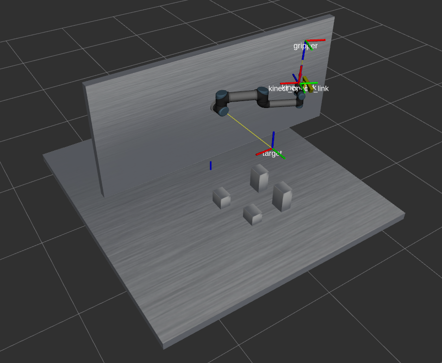

# Project-MIAPR
**Implementation of RRT and A* path planning algorithms for UR5 robot arm model**  

Aim of the project was to create robotic station in which robotic arm will try to move on the surfaces of the objects. Robot knows where objects are, because it has a Kinect sensor attached to his arm. So let's start from beggining:

**1. UR5 Robot, Kinect camera and workplace:**  

The UR5 is a lightweight, adaptable collaborative industrial robot that tackles medium-duty applications with ultimate flexibility. All files that are needed to work with this robot in ROS, are available to download here:
- https://github.com/UniversalRobots/Universal_Robots_ROS_Driver
- https://github.com/fmauch/universal_robot

Kinect sensor is widely used in robotics, because of it's features. It has:
- a RGB color camera,
- a depth sensor,
- a microphone,
- a set of advanced software to capture motion and gestures.

Configuration of Kinect sensor you can find in my package in *ur5_robot/urdf/objects.urdf.xacro*

Workplace was created in Blender. Creating your own workstation in ROS is simple:
1. Create object in a 3D Editor e.g Blender.
2. Export your object as **.obj** file . If you added meshes to your object,remember to put them in your package in file e.g */ur5_robot/meshes* as **.dae** files.
3. Create urdf.xacro file for your station - you can see how have i done it in */ur5_robot/urdf/myObject.urdf.xacro*.
4. Load your station to your launch file. 

You can see how my station looks like below:  

**2. RRT and A* algorithms:*  

**RRT**(Rapidly-exploring random tree) is a single query planner that grows a tree of states connected by valid motions. 

**A*** - is a graph traversal and path search algorithm, which is often used in many fields of computer science due to its completeness, optimality, and optimal efficiency.  

**3. View frames:**  
You can see how frames in project depend on each other in **frames.pdf** file.

